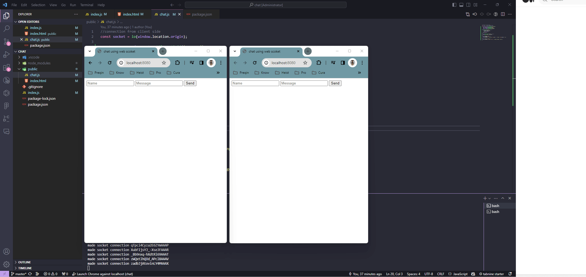

# WebSocket Chat App

This is a simple real-time chat application built with WebSockets.

## Getting Started

These instructions will get you a copy of the project up and running on your local machine for development and testing purposes.

### Prerequisites

- Node.js (Download and install from [here](https://nodejs.org/en/download/))
- A package manager like npm (comes with Node.js) or yarn

### Tech stack
- Node.js
- Express
- Socket.io

## Installation

1. Clone the repository:

```bash
git clone https://github.com/Anilpandiya/chat.git
```

2. Navigate into the project directory:

```bash
cd chat
```

3. Install the dependencies:

```bash
npm install
```

4. Start the server:

```bash
npx nodemon
```

The application will start running at http://localhost:8080.

## Demo



## Resources

Here are some resources that might be helpful:

- [WebSocket: An In-Depth Beginner’s Guide](https://javascript.plainenglish.io/websocket-an-in-depth-beginners-guide-96f617c4c7a5)
- [WebSockets](https://medium.com/@tfarguts/websockets-for-beginners-part-1-10796106e207)
